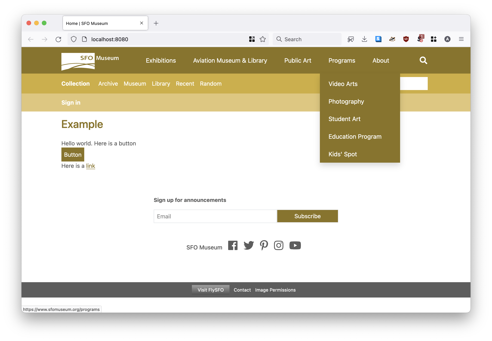
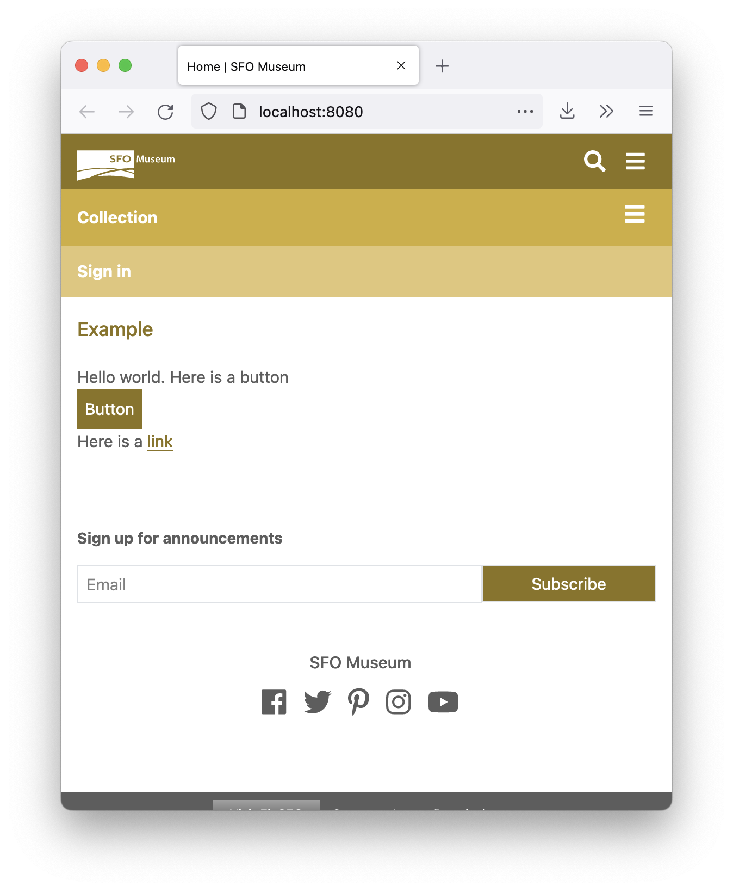

# go-http-sfomuseum

Go package to provide common elements for SFO Museum web applications, notably headers and footers.

## Documentation

## Motivation

Aside from providing reusable components for Go-based web applications the hope is that we can use this package to define modular components (templates, CSS, JS) for common elements across all SFO Museum websites, regardless of the application framework or programming language they use.

The templates will not be portable across languages but the idea is for this package to be the reference implementation for things like the navigation header that other application might adapt or supplement as needed.

This package remains under active development. For a list of "known knowns" please consult the [Issues](https://github.com/sfomuseum/go-http-sfomuseum/issues) section.

## Usage

For now, have a look at [cmd/example/main.go](cmd/example/main.go)